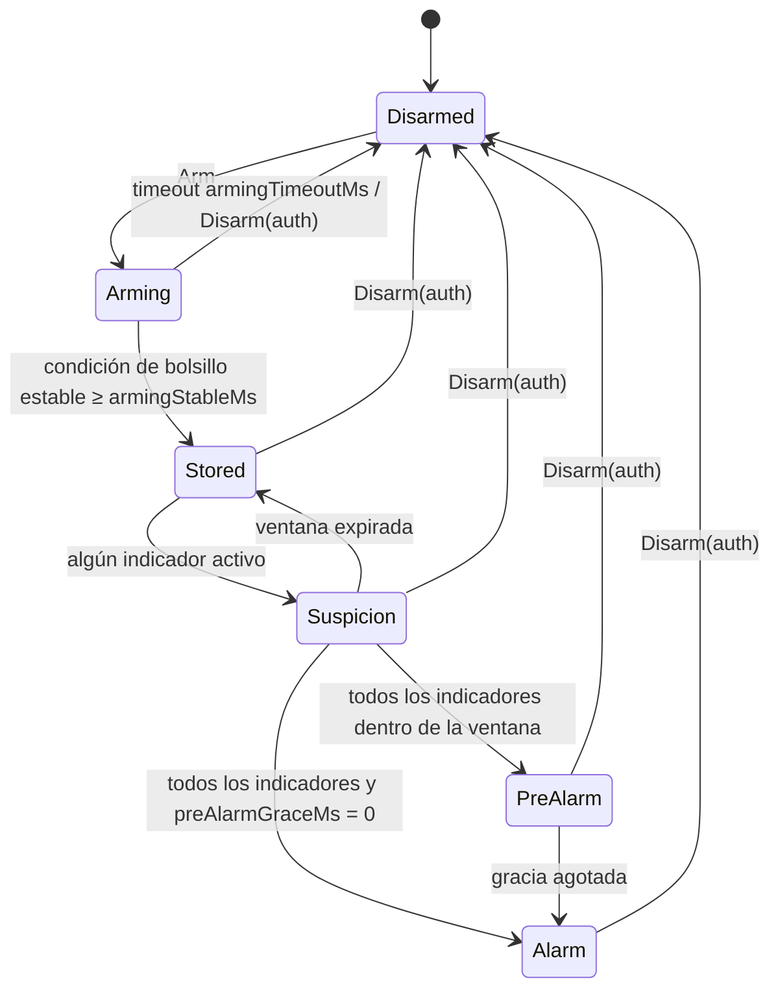
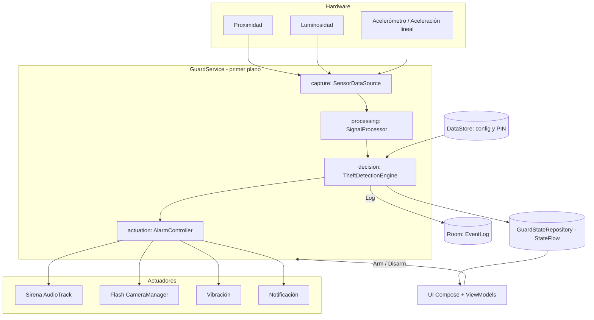

# PocketGuard — Especificación de arquitectura y requerimientos

> **Documento base del proyecto.** Taller 2 — Desarrollo de un Sistema Integrado (UNI, 2026-2).
> Plataforma: Android · Lenguaje: Kotlin · IDE: Android Studio.
> Ubicación sugerida en el repositorio: `docs/SPEC.md`.

---

## 0. Instrucciones para Claude Code

Lee este documento completo antes de escribir código. Es la fuente de verdad del proyecto.

1. Crea el proyecto Android desde cero siguiendo la **sección 12 (Plan de implementación)**, fase por fase y en orden.
2. Al terminar cada fase ejecuta `./gradlew assembleDebug` y `./gradlew testDebugUnitTest`. No avances a la siguiente fase si alguno falla.
3. Haz **un commit por fase** con el mensaje indicado (formato Conventional Commits).
4. Respeta la estructura de paquetes de la **sección 7.3**. El paquete `decision` **no puede importar nada de `android.*` ni `androidx.*`**: debe ser Kotlin puro.
5. Usa las versiones estables más recientes de cada dependencia, compatibles con el Android Gradle Plugin instalado, declaradas en `gradle/libs.versions.toml`. No agregues librerías que no estén en la **sección 7.6** sin justificarlo en el commit.
6. Todos los valores numéricos configurables salen de `DetectionConfig` (sección 8.4). No escribas umbrales "mágicos" dentro de la lógica.
7. Los textos visibles para el usuario van en `res/values/strings.xml`, en español.
8. Si una API de Android se comporta distinto según la versión, maneja ambas ramas con `Build.VERSION.SDK_INT` y deja un comentario breve.
9. Si algo de este documento es ambiguo o técnicamente inviable, elige la opción más simple que cumpla el requisito y documéntala en `docs/DECISIONES.md`.

---

## 1. Descripción general

### 1.1 Propósito

PocketGuard es una alarma antirrobo para teléfonos Android. El usuario **arma** la alarma y guarda el teléfono en el bolsillo o la mochila. Si alguien lo saca sin autorización, el teléfono lo detecta combinando tres sensores y activa automáticamente una sirena, el flash estroboscópico y la vibración.

### 1.2 Relación con el Taller 2

El sistema implementa el flujo exigido:

```
ENTRADA FÍSICA → PROCESAMIENTO → DECISIÓN → ACCIÓN FÍSICA
(proximidad,     (filtros,         (máquina de   (sirena, flash,
 luz,             histéresis,       estados con   vibración,
 acelerómetro)    fusión)           decisión      notificación)
                                    conjunta)
```

| Requisito del taller | Cómo lo cumple PocketGuard |
|---|---|
| Al menos 2 capacidades físicas de entrada | Proximidad, luminosidad y acelerómetro (3) |
| Al menos 1 capacidad física de salida | Sirena, flash, vibración y notificación de alta prioridad (4) |
| Entradas que deciden conjuntamente | La alarma solo se dispara si los 3 indicadores coinciden dentro de una ventana de 1 s. Ningún sensor por sí solo puede dispararla |
| Procesar, decidir y actuar automáticamente | Pipeline continuo dentro de un servicio en primer plano |
| Responder a cambios del entorno en ejecución | Reacciona en tiempo real a los eventos de los sensores |
| Separar captura, procesamiento, decisión y actuación | Un paquete por responsabilidad (sección 7.3) |

### 1.3 Alcance

**Incluido:** armado y desarmado, detección de guardado y de extracción, pre-alarma con periodo de gracia, alarma multicanal, desarme con PIN y biometría, monitor de sensores en vivo, ajuste de parámetros, historial de eventos y grabación de trazas en CSV (modo debug).

**Excluido:** envío de SMS o ubicación, backend o nube, arranque automático al encender el teléfono, soporte para tablets o Wear OS, e impedir que el teléfono se apague con el botón físico (limitación de la plataforma).

### 1.4 Glosario

| Término | Definición |
|---|---|
| Armar | Activar la vigilancia |
| Desarmar | Desactivar la vigilancia o una alarma en curso |
| Condición de bolsillo | Proximidad "cerca" y ambiente "oscuro" al mismo tiempo |
| Luz base | Nivel de luz registrado al confirmar que el teléfono está guardado |
| Salto de luz | Aumento de luz respecto a la luz base que supera el umbral configurado |
| Movimiento | Magnitud de la aceleración lineal (sin gravedad) mayor al umbral |
| Ventana de coincidencia | Intervalo en el que deben ocurrir los indicadores para considerar una extracción |
| Periodo de gracia | Tiempo que tiene el dueño para autenticarse antes de que suene la alarma |
| Snapshot | Estado fusionado de todos los sensores en un instante |
| Efecto | Orden que la capa de decisión emite para que la capa de actuación la ejecute |

---

## 2. Actores

| Actor | Descripción |
|---|---|
| Dueño | Usuario legítimo. Configura el PIN, arma, desarma y ajusta parámetros |
| Intruso | Persona que intenta sacar el teléfono sin autorización. No interactúa con la app de forma intencional |
| Sistema Android | Provee los eventos de los sensores, el ciclo de vida del servicio, las notificaciones y los actuadores |

---

## 3. Requerimientos funcionales

Prioridad según MoSCoW: **M** = Must (obligatorio), **S** = Should (debería), **C** = Could (opcional).

### 3.1 Configuración y seguridad

| ID | Requerimiento | Prioridad |
|---|---|---|
| RF-01 | En el primer uso, la app debe pedir al dueño que cree un PIN de 4 a 6 dígitos, con confirmación | M |
| RF-02 | El PIN debe guardarse como hash PBKDF2 con sal aleatoria, nunca en texto plano | M |
| RF-03 | La app debe permitir desarmar con biometría si el dispositivo la soporta y el dueño la habilita, con el PIN siempre como respaldo | S |
| RF-04 | La app debe solicitar en tiempo de ejecución los permisos necesarios (notificaciones) y explicar por qué se piden | M |
| RF-05 | Tras 5 intentos fallidos de PIN, la app debe bloquear el ingreso durante 30 s | S |

### 3.2 Capacidades del dispositivo

| ID | Requerimiento | Prioridad |
|---|---|---|
| RF-06 | Al iniciar, la app debe detectar qué sensores existen (proximidad, luz, acelerómetro, aceleración lineal) y si hay flash | M |
| RF-07 | El acelerómetro es obligatorio. De proximidad y luz se requiere al menos uno. Si falta alguno, la app funciona en **modo degradado** con los sensores disponibles y lo indica en pantalla | M |
| RF-08 | Si no se cumple el mínimo de RF-07, la app debe impedir el armado y explicar el motivo | M |

### 3.3 Armado y detección

| ID | Requerimiento | Prioridad |
|---|---|---|
| RF-09 | El dueño debe poder armar la alarma con un botón | M |
| RF-10 | Al armar, el sistema debe iniciar un servicio en primer plano con una notificación persistente que indique el estado | M |
| RF-11 | Tras armar, el sistema debe esperar a que se cumpla la condición de bolsillo de forma estable durante `armingStableMs` antes de considerar el teléfono guardado | M |
| RF-12 | Si la condición de bolsillo no se cumple dentro de `armingTimeoutMs`, el sistema debe volver a desarmado y avisar al dueño | M |
| RF-13 | Al confirmar el guardado, el sistema debe registrar la luz base | M |
| RF-14 | Con el teléfono guardado, el sistema debe abrir una ventana de sospecha cuando se active cualquier indicador (proximidad lejos, salto de luz o movimiento) | M |
| RF-15 | El sistema debe declarar una extracción **solo** si todos los indicadores disponibles están activos dentro de la ventana de coincidencia | M |
| RF-16 | Si la ventana expira sin completarse, el sistema debe volver al estado guardado sin emitir alarma | M |
| RF-17 | Durante la sospecha, el sistema debe aumentar la frecuencia de muestreo del acelerómetro, y reducirla al salir | S |
| RF-18 | El sistema debe seguir funcionando con la pantalla apagada y con la app cerrada desde recientes | M |

### 3.4 Pre-alarma y alarma

| ID | Requerimiento | Prioridad |
|---|---|---|
| RF-19 | Al detectar una extracción, el sistema debe entrar en pre-alarma: vibración suave y una pantalla de desbloqueo durante `preAlarmGraceMs` | M |
| RF-20 | Si el dueño se autentica durante la pre-alarma, el sistema debe desarmarse sin activar la sirena | M |
| RF-21 | Si el periodo de gracia termina sin autenticación, o si vale 0, el sistema debe activar la alarma | M |
| RF-22 | La alarma debe activar a la vez: sirena por el canal de alarma a volumen máximo, flash estroboscópico, vibración continua y notificación de alta prioridad no descartable | M |
| RF-23 | La sirena debe sonar aunque el teléfono esté en modo silencio o vibración | M |
| RF-24 | La alarma solo debe detenerse con autenticación correcta | M |
| RF-25 | Al detenerse la alarma, el sistema debe restaurar el volumen de alarma previo y apagar el flash | M |
| RF-26 | La pantalla de alarma debe mostrarse sobre la pantalla de bloqueo y encender la pantalla | S |

### 3.5 Monitoreo, configuración e historial

| ID | Requerimiento | Prioridad |
|---|---|---|
| RF-27 | La app debe ofrecer una pantalla de monitor que muestre en vivo: distancia de proximidad, lux, magnitud de movimiento, estado actual y los indicadores de la ventana de sospecha | M |
| RF-28 | El dueño debe poder ajustar los parámetros de `DetectionConfig` desde una pantalla de ajustes, con valores por defecto y un botón para restablecerlos | S |
| RF-29 | La app debe ofrecer tres perfiles de sensibilidad (Baja, Media, Alta) que ajusten varios umbrales a la vez | C |
| RF-30 | El sistema debe registrar en un historial los eventos: armado, guardado, sospecha, pre-alarma, alarma, desarme y timeout, con fecha y hora | S |
| RF-31 | En compilaciones debug, la app debe permitir grabar las lecturas de los sensores en un archivo CSV | S |
| RF-32 | En compilaciones debug, la pantalla de alarma debe incluir un botón "Detener (debug)" que desarme sin PIN, para facilitar las pruebas y la demostración | C |

---

## 4. Requerimientos no funcionales

| ID | Categoría | Requerimiento | Cómo se verifica |
|---|---|---|---|
| RNF-01 | Rendimiento | La latencia entre la extracción y el inicio de la sirena (con gracia = 0) debe ser menor a 300 ms en el percentil 95 | Log con marcas de tiempo en `EventLog` |
| RNF-02 | Fiabilidad | Cero falsas alarmas en los escenarios negativos de la sección 11.2 | Pruebas de aceptación manuales |
| RNF-03 | Fiabilidad | Tasa de detección de al menos 9 de 10 extracciones reales en los escenarios positivos | Pruebas de aceptación manuales |
| RNF-04 | Disponibilidad | El servicio debe seguir activo durante al menos 30 min con la pantalla apagada | Escenario E7 |
| RNF-05 | Eficiencia | En estado desarmado no debe haber listeners de sensores registrados ni wake locks tomados | Revisión de código y `dumpsys sensorservice` |
| RNF-06 | Eficiencia | El acelerómetro debe usar `SENSOR_DELAY_UI` en reposo y `SENSOR_DELAY_GAME` solo durante la sospecha | Revisión de código |
| RNF-07 | Seguridad | El PIN nunca se guarda ni se registra en texto plano, ni aparece en logs | Revisión de código |
| RNF-08 | Seguridad | Cerrar la app desde recientes no debe desarmar el sistema | Escenario E8 |
| RNF-09 | Compatibilidad | minSdk 26 (Android 8.0). targetSdk y compileSdk: la versión estable más reciente soportada por el AGP instalado | Configuración de Gradle |
| RNF-10 | Mantenibilidad | El paquete `decision` no depende de Android y tiene cobertura de pruebas unitarias de al menos 90 % de líneas | Reporte de cobertura (Kover o JaCoCo) |
| RNF-11 | Mantenibilidad | Cada capa se comunica con la siguiente mediante interfaces o tipos de datos definidos, no mediante clases concretas de otra capa | Revisión de código |
| RNF-12 | Usabilidad | Armar requiere como máximo 1 toque desde la pantalla principal | Prueba manual |
| RNF-13 | Usabilidad | La interfaz sigue Material 3 y soporta tema claro y oscuro | Prueba manual |
| RNF-14 | Accesibilidad | Todos los botones tienen `contentDescription` y tamaño táctil mínimo de 48 dp | Accessibility Scanner |
| RNF-15 | Observabilidad | Cada transición de estado se registra con `Log.d` bajo el tag `PocketGuard`, incluyendo estado anterior, nuevo estado y motivo | Logcat |
| RNF-16 | Robustez | Si el flash no existe o está ocupado, la alarma continúa con los demás actuadores sin fallar | Prueba en dispositivo sin flash o con la cámara abierta |

---

## 5. Casos de uso

### 5.1 Resumen

| ID | Caso de uso | Actor principal |
|---|---|---|
| CU-01 | Configurar PIN inicial | Dueño |
| CU-02 | Armar la alarma | Dueño |
| CU-03 | Confirmar guardado del teléfono | Sistema |
| CU-04 | Detectar extracción y disparar la alarma | Sistema (provocado por el intruso) |
| CU-05 | Cancelar la pre-alarma (el dueño saca su teléfono) | Dueño |
| CU-06 | Detener la alarma | Dueño |
| CU-07 | Desarmar manualmente | Dueño |
| CU-08 | Consultar el monitor de sensores | Dueño |
| CU-09 | Ajustar parámetros de detección | Dueño |
| CU-10 | Consultar el historial | Dueño |
| CU-11 | Grabar trazas de sensores (debug) | Dueño |

### 5.2 Especificación detallada

#### CU-01 Configurar PIN inicial
- **Precondición:** primera ejecución, sin PIN guardado.
- **Flujo principal:**
  1. La app muestra la pantalla de bienvenida con una explicación breve.
  2. El dueño ingresa un PIN de 4 a 6 dígitos.
  3. El dueño lo confirma.
  4. El sistema guarda el hash y la sal.
  5. El sistema pide el permiso de notificaciones (Android 13 o superior).
  6. La app navega a la pantalla principal.
- **Flujos alternativos:**
  - 3a. Los PIN no coinciden: se muestra un error y se vuelve al paso 2.
  - 5a. Se niega el permiso: se muestra un aviso de que la alarma no podrá mostrar notificaciones y un botón que abre los ajustes del sistema.
- **Postcondición:** existe un PIN guardado.
- **Requerimientos:** RF-01, RF-02, RF-04.

#### CU-02 Armar la alarma
- **Precondición:** PIN configurado, sensores mínimos disponibles (RF-07), estado desarmado.
- **Flujo principal:**
  1. El dueño pulsa "Armar".
  2. El sistema inicia `GuardService` en primer plano.
  3. El sistema registra los listeners de sensores y toma el wake lock.
  4. El estado pasa a `ARMANDO` y la notificación persistente muestra "Guarda el teléfono en tu bolsillo".
  5. Continúa CU-03.
- **Flujo alternativo:**
  - 1a. Sensores insuficientes: el botón está deshabilitado y se muestra el motivo (RF-08).
- **Requerimientos:** RF-09, RF-10.

#### CU-03 Confirmar guardado del teléfono
- **Precondición:** estado `ARMANDO`.
- **Flujo principal:**
  1. El dueño guarda el teléfono.
  2. El sistema detecta la condición de bolsillo.
  3. La condición se mantiene durante `armingStableMs`.
  4. El sistema registra la luz base.
  5. El estado pasa a `GUARDADO` y el teléfono emite una vibración corta de confirmación.
- **Flujos alternativos:**
  - 3a. La condición se interrumpe antes de tiempo: el contador se reinicia.
  - 3b. Se supera `armingTimeoutMs`: el sistema vuelve a `DESARMADO`, detiene el servicio y notifica "No se detectó el bolsillo".
- **Requerimientos:** RF-11, RF-12, RF-13.

#### CU-04 Detectar extracción y disparar la alarma
- **Precondición:** estado `GUARDADO`.
- **Flujo principal:**
  1. El intruso saca el teléfono del bolsillo.
  2. Se activa al menos un indicador; el sistema abre la ventana de sospecha (`SOSPECHA`) y sube la frecuencia del acelerómetro.
  3. Dentro de la ventana se activan todos los indicadores disponibles.
  4. El estado pasa a `PRE_ALARMA`: vibración suave y pantalla de desbloqueo.
  5. El periodo de gracia termina sin autenticación.
  6. El estado pasa a `ALARMA`: sirena, flash estroboscópico, vibración continua y notificación.
- **Flujos alternativos:**
  - 3a. La ventana expira incompleta: el sistema vuelve a `GUARDADO` (RF-16).
  - 4a. `preAlarmGraceMs = 0`: el sistema pasa directamente a `ALARMA`.
- **Requerimientos:** RF-14 a RF-23.

#### CU-05 Cancelar la pre-alarma
- **Precondición:** estado `PRE_ALARMA`.
- **Flujo principal:**
  1. El dueño ve la pantalla de desbloqueo.
  2. Ingresa el PIN o usa la biometría.
  3. El sistema valida y pasa a `DESARMADO` sin activar la sirena.
- **Flujo alternativo:**
  - 2a. PIN incorrecto: se muestra un error. Si se agota la gracia, continúa CU-04 paso 6.
- **Requerimientos:** RF-20.

#### CU-06 Detener la alarma
- **Precondición:** estado `ALARMA`.
- **Flujo principal:**
  1. El dueño toca la notificación o la pantalla de alarma.
  2. Se autentica.
  3. El sistema detiene todos los actuadores, restaura el volumen y pasa a `DESARMADO`.
- **Flujo alternativo:**
  - 2a. 5 intentos fallidos: el ingreso se bloquea 30 s y la alarma sigue sonando (RF-05).
- **Requerimientos:** RF-24, RF-25, RF-26.

#### CU-07 Desarmar manualmente
- **Precondición:** estado `ARMANDO` o `GUARDADO`.
- **Flujo principal:**
  1. El dueño pulsa "Desarmar" en la app o en la acción de la notificación.
  2. Se autentica.
  3. El sistema pasa a `DESARMADO`, libera los sensores y el wake lock, y detiene el servicio.
- **Requerimientos:** RF-24.

#### CU-08 Consultar el monitor de sensores
- **Flujo principal:**
  1. El dueño abre "Monitor".
  2. La pantalla muestra en vivo los valores de RF-27, actualizados al menos 10 veces por segundo.
- **Nota:** si el sistema está desarmado, el monitor registra los sensores solo mientras la pantalla está visible.
- **Requerimientos:** RF-27.

#### CU-09 Ajustar parámetros de detección
- **Precondición:** estado `DESARMADO`. Los ajustes se bloquean mientras la alarma está armada.
- **Flujo principal:**
  1. El dueño abre "Ajustes".
  2. Modifica los parámetros o elige un perfil.
  3. El sistema valida los rangos y los guarda en DataStore.
- **Requerimientos:** RF-28, RF-29.

#### CU-10 Consultar el historial
- **Flujo principal:**
  1. El dueño abre "Historial".
  2. La app muestra los eventos ordenados del más reciente al más antiguo.
  3. El dueño puede borrar el historial.
- **Requerimientos:** RF-30.

#### CU-11 Grabar trazas de sensores (solo debug)
- **Flujo principal:**
  1. En el monitor, el dueño pulsa "Grabar".
  2. El sistema escribe cada snapshot en `filesDir/traces/trace_<timestamp>.csv`.
  3. El dueño pulsa "Detener".
  4. La app permite compartir el archivo con un intent de envío.
- **Requerimientos:** RF-31.

---

## 6. Máquina de estados (lógica de decisión)

### 6.1 Diagrama



### 6.2 Estados

| Estado (código) | Nombre en UI | Descripción |
|---|---|---|
| `Disarmed` | Desarmado | Sin vigilancia. Sin sensores ni wake lock |
| `Arming(startedAtNs, pocketSinceNs?)` | Armando | Espera la condición de bolsillo estable |
| `Stored(baselineLux)` | Guardado | Teléfono en el bolsillo, vigilando |
| `Suspicion(openedAtNs, baselineLux, flags)` | Sospecha | Ventana de coincidencia abierta |
| `PreAlarm(startedAtNs)` | Pre-alarma | Periodo de gracia para el dueño |
| `Alarm(startedAtNs)` | Alarma | Actuadores activos hasta la autenticación |

### 6.3 Indicadores

Con el snapshot `s` y la luz base `b`:

| Indicador | Condición | Sensor |
|---|---|---|
| `proximityFar` | `!s.isNear` | Proximidad |
| `lightJump` | `s.lux >= max(b * lightJumpFactor, lightJumpMinLux)` | Luz |
| `motion` | `s.motion >= motionThreshold` | Acelerómetro |

- `flags` acumula los indicadores con OR lógico mientras la ventana está abierta.
- Un indicador cuyo sensor no está disponible (modo degradado) se considera **siempre satisfecho**, así que la decisión se toma con los sensores restantes.
- Se abre la sospecha cuando, estando en `Stored`, cualquier indicador disponible está activo en el snapshot actual. Se evalúa por nivel, no por flanco. Así, si alguien saca el teléfono lentamente y la ventana expira, el siguiente snapshot vuelve a abrir la sospecha, y cualquier movimiento posterior completa la detección.

### 6.4 Tabla de transiciones y efectos

| Desde | Entrada | Condición | Hacia | Efectos |
|---|---|---|---|---|
| `Disarmed` | `Arm` | Sensores mínimos disponibles | `Arming` | `StartMonitoring`, `AcquireWakeLock`, `SetSampling(NORMAL)`, `UpdateStatusNotification`, `Log(ARMED)` |
| `Disarmed` | `Arm` | Sensores insuficientes | `Disarmed` | `ShowMessage(INSUFFICIENT_SENSORS)` |
| `Arming` | `Snapshot` | Bolsillo verdadero y `pocketSinceNs` nulo | `Arming` (con `pocketSinceNs = now`) | — |
| `Arming` | `Snapshot` | Bolsillo verdadero y `now − pocketSinceNs ≥ armingStableMs` | `Stored(lux)` | `Vibrate(CONFIRM)`, `UpdateStatusNotification`, `Log(STORED)` |
| `Arming` | `Snapshot` | Bolsillo falso | `Arming` (con `pocketSinceNs = null`) | — |
| `Arming` | `Tick` | `now − startedAtNs ≥ armingTimeoutMs` | `Disarmed` | `StopMonitoring`, `ReleaseWakeLock`, `ShowMessage(ARMING_TIMEOUT)`, `Log(TIMEOUT)` |
| `Stored` | `Snapshot` | Algún indicador activo | `Suspicion` | `SetSampling(HIGH)`, `Log(SUSPICION)` |
| `Suspicion` | `Snapshot` | Todos los indicadores activos y gracia > 0 | `PreAlarm` | `Vibrate(SOFT)`, `ShowPreAlarmUi`, `Log(PRE_ALARM)` |
| `Suspicion` | `Snapshot` | Todos los indicadores activos y gracia = 0 | `Alarm` | Efectos de alarma (ver abajo) |
| `Suspicion` | `Tick` | `now − openedAtNs ≥ coincidenceWindowMs` | `Stored` | `SetSampling(NORMAL)` |
| `PreAlarm` | `Tick` | `now − startedAtNs ≥ preAlarmGraceMs` | `Alarm` | Efectos de alarma |
| Cualquiera excepto `Disarmed` | `Disarm(authOk = true)` | — | `Disarmed` | `StopAll`, `StopMonitoring`, `ReleaseWakeLock`, `ClearAlarmUi`, `Log(DISARMED)` |
| Cualquiera | `Disarm(authOk = false)` | — | Sin cambio | `Log(AUTH_FAILED)` |

**Efectos de alarma:** `StartSiren`, `StartStrobe`, `Vibrate(ALARM)`, `ShowAlarmUi`, `Log(ALARM)`.

La condición de bolsillo es `isNear && isDark`. En modo degradado, el término del sensor faltante se considera verdadero.

---

## 7. Arquitectura

### 7.1 Estilo

- **Clean Architecture ligera + MVVM + flujo de datos unidireccional**, en un solo módulo Gradle (`app`) organizado por paquetes.
- La **decisión es un reducer puro**: `reduce(state, input) → (newState, effects)`. No ejecuta acciones; solo describe qué hay que hacer.
- La **actuación interpreta los efectos**. Ninguna otra capa llama a los actuadores.
- El **servicio en primer plano** (`GuardService`) aloja y orquesta el pipeline. La UI solo observa el estado y envía comandos.

### 7.2 Diagrama de componentes



### 7.3 Estructura de paquetes

```
app/src/main/java/com/equipo/pocketguard/
├── PocketGuardApp.kt                 @HiltAndroidApp, crea los canales de notificación
├── capture/
│   ├── SensorDataSource.kt           Flows de eventos por sensor (callbackFlow)
│   ├── SensorCapabilityChecker.kt    Detecta sensores y flash disponibles
│   ├── SensorCapabilities.kt         data class con la disponibilidad de cada sensor
│   └── TraceRecorder.kt              Grabación CSV (solo debug)
├── processing/
│   ├── SignalProcessor.kt            Fusiona los flows y emite SensorSnapshot
│   ├── SensorSnapshot.kt
│   ├── ExponentialSmoother.kt        Filtro EMA
│   ├── GravityFilter.kt              Filtro pasa-altos si no hay aceleración lineal
│   └── Hysteresis.kt                 Detector oscuro/claro con dos umbrales
├── decision/                         ⚠ Kotlin puro: sin android.* ni androidx.*
│   ├── GuardState.kt
│   ├── GuardInput.kt
│   ├── Effect.kt
│   ├── Indicators.kt
│   ├── DetectionConfig.kt
│   └── TheftDetectionEngine.kt
├── actuation/
│   ├── Actuator.kt                   interface Actuator { start(); stop() }
│   ├── AlarmController.kt            Traduce Effect → llamadas a actuadores
│   ├── SirenActuator.kt
│   ├── TorchActuator.kt
│   ├── VibrationActuator.kt
│   └── AlarmNotifier.kt              Notificaciones de estado, pre-alarma y alarma
├── service/
│   ├── GuardService.kt               Orquestador del pipeline
│   ├── GuardCommands.kt              Acciones de Intent (ARM, DISARM)
│   └── WakeLockManager.kt
├── data/
│   ├── GuardStateRepository.kt       @Singleton, StateFlow<GuardUiState>
│   ├── SettingsRepository.kt         DataStore para DetectionConfig y preferencias
│   ├── PinRepository.kt              Hash y sal del PIN en DataStore
│   └── eventlog/                     Room: EventEntity, EventDao, AppDatabase
├── security/
│   ├── PinHasher.kt                  PBKDF2WithHmacSHA256, 120 000 iteraciones, sal de 16 bytes
│   ├── BiometricAuthenticator.kt
│   └── AuthAttemptLimiter.kt         RF-05
├── ui/
│   ├── MainActivity.kt
│   ├── AlarmActivity.kt              Se muestra sobre la pantalla de bloqueo
│   ├── navigation/AppNavHost.kt
│   ├── onboarding/                   CU-01
│   ├── home/                         CU-02, CU-07
│   ├── monitor/                      CU-08, CU-11
│   ├── settings/                     CU-09
│   ├── history/                      CU-10
│   ├── alarm/                        CU-05, CU-06 (pad de PIN)
│   └── theme/
└── di/
    ├── AppModule.kt
    ├── SensorModule.kt
    └── ActuationModule.kt
```

### 7.4 Contratos principales

```kotlin
// ---------- processing ----------
data class SensorSnapshot(
    val isNear: Boolean,       // proximidad; true si el sensor no existe
    val distanceCm: Float?,    // valor crudo, para el monitor
    val lux: Float?,           // suavizado con EMA; null si no hay sensor
    val isDark: Boolean,       // salida del detector con histéresis; true si no hay sensor
    val motion: Float,         // |aceleración lineal| en m/s²
    val timestampNs: Long      // SystemClock.elapsedRealtimeNanos() al recibir el evento
)

// ---------- decision ----------
sealed interface GuardState {
    data object Disarmed : GuardState
    data class Arming(val startedAtNs: Long, val pocketSinceNs: Long?) : GuardState
    data class Stored(val baselineLux: Float) : GuardState
    data class Suspicion(val openedAtNs: Long, val baselineLux: Float, val flags: Indicators) : GuardState
    data class PreAlarm(val startedAtNs: Long) : GuardState
    data class Alarm(val startedAtNs: Long) : GuardState
}

data class Indicators(val proximityFar: Boolean, val lightJump: Boolean, val motion: Boolean) {
    infix fun or(o: Indicators) = Indicators(proximityFar || o.proximityFar, lightJump || o.lightJump, motion || o.motion)
}

data class AvailableSensors(val proximity: Boolean, val light: Boolean, val accelerometer: Boolean)

sealed interface GuardInput {
    data class Arm(val sensors: AvailableSensors, val nowNs: Long) : GuardInput
    data class Disarm(val authOk: Boolean) : GuardInput
    data class Snapshot(val snapshot: SensorSnapshot) : GuardInput
    data class Tick(val nowNs: Long) : GuardInput
}

sealed interface Effect {
    data object StartMonitoring : Effect
    data object StopMonitoring : Effect
    data object AcquireWakeLock : Effect
    data object ReleaseWakeLock : Effect
    data class SetSampling(val mode: SamplingMode) : Effect   // NORMAL | HIGH
    data object StartSiren : Effect
    data object StartStrobe : Effect
    data class Vibrate(val pattern: VibrationPattern) : Effect  // CONFIRM | SOFT | ALARM
    data object StopAll : Effect
    data object ShowPreAlarmUi : Effect
    data object ShowAlarmUi : Effect
    data object ClearAlarmUi : Effect
    data object UpdateStatusNotification : Effect
    data class ShowMessage(val code: MessageCode) : Effect
    data class Log(val type: EventType, val detail: String = "") : Effect
}

class TheftDetectionEngine(private val config: DetectionConfig) {
    fun reduce(state: GuardState, input: GuardInput): Transition
}
data class Transition(val state: GuardState, val effects: List<Effect>)

// ---------- actuation ----------
interface Actuator { fun start(); fun stop() }
```

`TheftDetectionEngine` guarda internamente los `AvailableSensors` recibidos en `Arm`. Alternativa aceptable: incluirlos en `Arming` y propagarlos por los estados siguientes. Elige una opción y documéntala en `docs/DECISIONES.md`.

### 7.5 Orquestación en `GuardService`

1. `onStartCommand(ARM)`: llama a `startForeground` con la notificación de estado y `foregroundServiceType` `specialUse` (API 34+). Luego envía `GuardInput.Arm` al motor.
2. **Bucle único de procesamiento:** un solo `Channel<GuardInput>` consumido en una corrutina con `Dispatchers.Default`. Así el acceso al estado es serial y no hay condiciones de carrera. Productores:
   - los snapshots de `SignalProcessor` (mientras el monitoreo está activo);
   - un ticker cada 100 ms (solo en `Arming`, `Suspicion` y `PreAlarm`);
   - los comandos de desarme que llegan por Intent.
3. Por cada `Transition`: publica el estado en `GuardStateRepository`, ejecuta los efectos de monitoreo y wake lock en el servicio, y delega los demás en `AlarmController`.
4. `StartMonitoring` y `SetSampling` vuelven a registrar los listeners con el delay adecuado.
5. `onTaskRemoved`: no se detiene. El servicio devuelve `START_STICKY`. Si el sistema lo reinicia con un Intent nulo y DataStore indica que estaba armado, se vuelve a `Arming`.
6. Al llegar a `Disarmed`: libera todo, llama a `stopForeground(STOP_FOREGROUND_REMOVE)` y a `stopSelf()`.

### 7.6 Stack tecnológico

| Área | Tecnología |
|---|---|
| Build | Gradle Kotlin DSL, version catalog (`libs.versions.toml`), KSP |
| Lenguaje | Kotlin (JVM target 17) |
| UI | Jetpack Compose (BOM), Material 3, Navigation Compose, Lifecycle ViewModel Compose |
| Concurrencia | kotlinx-coroutines-android, Flow y StateFlow |
| Inyección de dependencias | Hilt (+ hilt-navigation-compose) |
| Persistencia | DataStore Preferences; Room (runtime, ktx, compiler con KSP) |
| Seguridad | androidx.biometric |
| Pruebas | JUnit 4, kotlinx-coroutines-test, Turbine, MockK, Kover (cobertura) |

---

## 8. Diseño detallado por capa

### 8.1 Captura

- `SensorManager.getDefaultSensor(type, wakeUp)`: para proximidad, intentar primero la variante wake-up (`true`) y, si no existe, la normal.
- Aceleración: preferir `TYPE_LINEAR_ACCELERATION`. Si no existe, usar `TYPE_ACCELEROMETER` con `GravityFilter`.
- Cada sensor se expone como `Flow<SensorEvent>` con `callbackFlow`, que desregistra el listener en `awaitClose`.
- Delays:
  - proximidad y luz: `SENSOR_DELAY_NORMAL`;
  - acelerómetro: `SENSOR_DELAY_UI` en modo NORMAL y `SENSOR_DELAY_GAME` en modo HIGH.
- `maxReportLatencyUs = 0` (sin batching).

### 8.2 Procesamiento

- `SignalProcessor` guarda el último valor de cada sensor y emite un `SensorSnapshot` cada vez que llega cualquier evento.
- **Proximidad:** `isNear = distance < min(sensor.maximumRange, 5f)`. Este criterio es seguro para sensores binarios, que solo reportan 0 o `maximumRange`.
- **Luz:** EMA con `alpha = luxSmoothingAlpha`. `Hysteresis`: pasa a oscuro si `lux < darkEnterLux` y a claro si `lux > darkExitLux`.
- **Movimiento:**
  - con aceleración lineal: `motion = sqrt(x² + y² + z²)`;
  - sin ella: `gravity = α·gravity + (1−α)·raw` con α = 0.8, y `linear = raw − gravity`.
- **Timestamp:** `SystemClock.elapsedRealtimeNanos()` en el momento de recepción, para que los snapshots y los ticks usen el mismo reloj.

### 8.3 Actuación

- **SirenActuator:** genera la sirena con `AudioTrack` en modo streaming: onda senoidal con barrido de 600 a 1 200 Hz en ciclos de 1 s, sin archivos de audio externos. Usa `AudioAttributes.USAGE_ALARM` y `CONTENT_TYPE_SONIFICATION`. Al iniciar, guarda el volumen de `STREAM_ALARM` y lo sube al máximo con `AudioManager.setStreamVolume`; al detener, lo restaura. Toda la síntesis corre en una corrutina con `Dispatchers.IO`.
- **TorchActuator:** usa `CameraManager` para buscar una cámara con `FLASH_INFO_AVAILABLE`. El estroboscopio alterna `setTorchMode` cada `strobeIntervalMs` en una corrutina. Captura `CameraAccessException` y, si falla, registra el error y sigue (RNF-16). No requiere el permiso `CAMERA`.
- **VibrationActuator:** usa `VibratorManager` en API 31+ y `Vibrator` en versiones anteriores. Patrones con `VibrationEffect.createWaveform`:
  - `CONFIRM`: un pulso de 150 ms;
  - `SOFT`: `[0, 200, 800]` repetido;
  - `ALARM`: `[0, 800, 200]` repetido.
  En API 33+ usa `VibrationAttributes.USAGE_ALARM`.
- **AlarmNotifier:** gestiona tres canales:
  - `guard_status` con `IMPORTANCE_LOW` (notificación persistente del servicio, con acción "Desarmar");
  - `pre_alarm` con `IMPORTANCE_HIGH`;
  - `alarm` con `IMPORTANCE_HIGH`, `CATEGORY_ALARM`, `ongoing`, no descartable.
  Usa `fullScreenIntent` hacia `AlarmActivity` solo si `NotificationManager.canUseFullScreenIntent()` lo permite (API 34+) o en versiones anteriores. Si no, basta la notificación heads-up.
- **AlarmActivity:** llama a `setShowWhenLocked(true)` y `setTurnScreenOn(true)` en API 27+, o usa los flags de ventana equivalentes en API 26. Contiene el pad de PIN, el botón de biometría y, en debug, el botón "Detener (debug)".

### 8.4 `DetectionConfig` (valores por defecto)

| Parámetro | Valor por defecto | Rango permitido | Uso |
|---|---|---|---|
| `armingStableMs` | 3 000 | 1 000–10 000 | RF-11 |
| `armingTimeoutMs` | 15 000 | 5 000–60 000 | RF-12 |
| `darkEnterLux` | 10 | 1–50 | Histéresis: entrar a oscuro |
| `darkExitLux` | 20 | `darkEnterLux + 5`–100 | Histéresis: salir de oscuro |
| `luxSmoothingAlpha` | 0.5 | 0.1–1.0 | Filtro EMA de luz |
| `lightJumpFactor` | 4.0 | 1.5–20 | Indicador `lightJump` |
| `lightJumpMinLux` | 30 | 5–500 | Indicador `lightJump` |
| `motionThreshold` | 2.5 m/s² | 0.5–10 | Indicador `motion` |
| `coincidenceWindowMs` | 1 000 | 300–3 000 | Ventana de sospecha |
| `preAlarmGraceMs` | 3 000 | 0–10 000 | Periodo de gracia |
| `strobeIntervalMs` | 150 | 80–1 000 | Estroboscopio |

**Perfiles (RF-29):**

| Perfil | `motionThreshold` | `lightJumpFactor` | `coincidenceWindowMs` |
|---|---|---|---|
| Baja | 4.0 | 6.0 | 800 |
| Media | 2.5 | 4.0 | 1 000 |
| Alta | 1.5 | 2.5 | 1 500 |

Los umbrales por defecto son un punto de partida. Deben calibrarse con trazas reales del teléfono de la demostración (CU-11).

---

## 9. Interfaz de usuario

| Pantalla | Contenido principal |
|---|---|
| Onboarding | Explicación en 3 pasos, creación del PIN y solicitud de permisos |
| Inicio | Indicador grande del estado con color, botón Armar/Desarmar, tarjeta de sensores disponibles (con aviso de modo degradado) y accesos a Monitor, Ajustes e Historial |
| Monitor | Valores en vivo de proximidad (cm y cerca/lejos), lux (crudo y suavizado, oscuro/claro), movimiento (con barra relativa al umbral), estado actual, 3 chips con los indicadores de la ventana y botón Grabar (solo debug) |
| Ajustes | Controles deslizantes para cada parámetro con su rango, selector de perfil, botón "Restablecer valores" y opción para habilitar biometría. Bloqueada mientras la alarma está armada |
| Historial | Lista de eventos con ícono, tipo, fecha y hora, y botón "Borrar historial" |
| Alarma | Pantalla completa en rojo, pad de PIN, botón de biometría, cuenta regresiva durante la pre-alarma y botón "Detener (debug)" solo en compilaciones debug |

Colores de estado: Desarmado en gris, Armando en ámbar, Guardado en verde, Sospecha en naranja, Pre-alarma y Alarma en rojo. El estado también se indica con texto, nunca solo con color.

---

## 10. Permisos y manifiesto

```xml
<uses-permission android:name="android.permission.FOREGROUND_SERVICE" />
<uses-permission android:name="android.permission.FOREGROUND_SERVICE_SPECIAL_USE" />
<uses-permission android:name="android.permission.POST_NOTIFICATIONS" />
<uses-permission android:name="android.permission.WAKE_LOCK" />
<uses-permission android:name="android.permission.VIBRATE" />
<uses-permission android:name="android.permission.USE_BIOMETRIC" />
<uses-permission android:name="android.permission.USE_FULL_SCREEN_INTENT" />

<uses-feature android:name="android.hardware.sensor.accelerometer" android:required="true" />
<uses-feature android:name="android.hardware.sensor.proximity" android:required="false" />
<uses-feature android:name="android.hardware.sensor.light" android:required="false" />
<uses-feature android:name="android.hardware.camera.flash" android:required="false" />

<service
    android:name=".service.GuardService"
    android:exported="false"
    android:foregroundServiceType="specialUse">
    <property
        android:name="android.app.PROPERTY_SPECIAL_USE_FGS_SUBTYPE"
        android:value="Monitoreo continuo de sensores para alarma antirrobo" />
</service>

<activity
    android:name=".ui.AlarmActivity"
    android:exported="false"
    android:showWhenLocked="true"
    android:turnScreenOn="true"
    android:launchMode="singleTask"
    android:excludeFromRecents="true" />
```

Notas:
- `POST_NOTIFICATIONS` se solicita en tiempo de ejecución en API 33+.
- El servicio se inicia siempre desde una acción del usuario en primer plano, lo que cumple las restricciones de inicio de servicios en segundo plano de Android 12+.
- Opcional: sugerir al usuario excluir la app de la optimización de batería (`ACTION_IGNORE_BATTERY_OPTIMIZATION_SETTINGS`), con una explicación. Algunos fabricantes cierran servicios de forma agresiva.

---

## 11. Estrategia de pruebas

### 11.1 Pruebas unitarias (obligatorias, en `src/test`)

**`TheftDetectionEngineTest`**, un test por fila de la tabla 6.4, más estos casos:

1. `Arm` con sensores insuficientes no cambia el estado.
2. La condición de bolsillo interrumpida reinicia `pocketSinceNs`.
3. Solo proximidad lejos, sin luz ni movimiento: la ventana expira y vuelve a `Stored`.
4. Solo movimiento (caminar con el teléfono en el bolsillo): no hay alarma.
5. Solo salto de luz (se enciende la luz de la habitación con el teléfono guardado): no hay alarma.
6. Los tres indicadores en snapshots distintos dentro de la ventana: `PreAlarm`.
7. Los tres indicadores repartidos en más tiempo que la ventana: no hay alarma.
8. Modo degradado sin sensor de luz: proximidad y movimiento bastan.
9. Con `preAlarmGraceMs = 0` se pasa directo a `Alarm`.
10. `Disarm(authOk = false)` en `Alarm` no cambia el estado.
11. Extracción lenta: la ventana expira, se vuelve a abrir y un movimiento posterior dispara la alarma.

**Otros tests:** `HysteresisTest`, `ExponentialSmootherTest`, `GravityFilterTest`, `PinHasherTest` (mismo PIN y sal producen el mismo hash; distinta sal produce distinto hash), `AuthAttemptLimiterTest`, `DetectionConfigValidationTest`.

**Test de arquitectura:** escanea los archivos fuente de `decision/` y falla si alguno importa `android.` o `androidx.`.

### 11.2 Pruebas de aceptación (manuales, en dispositivo real)

| ID | Escenario | Resultado esperado |
|---|---|---|
| E1 | Armar, guardar en el bolsillo, esperar la confirmación y sacar el teléfono con normalidad | Pre-alarma y luego alarma |
| E2 | Teléfono sobre la mesa; tapar y destapar el sensor con la mano | Sin alarma (nunca llega a `Stored`, o no hay movimiento) |
| E3 | Teléfono guardado; encender y apagar la luz de la habitación | Sin alarma |
| E4 | Teléfono guardado; caminar, sentarse, subir escaleras durante 2 min | Sin alarma |
| E5 | Teléfono guardado; sacarlo muy despacio y luego moverlo | Alarma al moverlo |
| E6 | Teléfono guardado; el dueño lo saca e ingresa el PIN durante la gracia | Desarmado sin sirena |
| E7 | Armar, guardar, esperar 10 min con la pantalla apagada y sacarlo | Alarma |
| E8 | Armar y cerrar la app desde recientes; guardar y sacar | Alarma |
| E9 | Teléfono en modo silencio; provocar la alarma | La sirena suena |
| E10 | Abrir la cámara en otra app y provocar la alarma | Sirena y vibración funcionan aunque el flash falle |

---

## 12. Plan de implementación (para Claude Code)

| Fase | Contenido | Mensaje de commit |
|---|---|---|
| 1 | Proyecto base: Gradle Kotlin DSL, version catalog, Hilt, Compose, tema Material 3, `MainActivity`, estructura de paquetes vacía, `.gitignore`, README inicial | `chore: estructura inicial del proyecto` |
| 2 | Paquete `decision` completo con `DetectionConfig` y todas las pruebas de la sección 11.1, incluido el test de arquitectura | `feat(decision): motor de detección y máquina de estados` |
| 3 | Paquete `processing` con sus pruebas | `feat(processing): filtros, histéresis y fusión de sensores` |
| 4 | Paquete `capture`: `SensorDataSource`, `SensorCapabilityChecker` | `feat(capture): captura de sensores con Flow` |
| 5 | Paquete `actuation`: los cuatro actuadores, `AlarmController` y canales de notificación | `feat(actuation): sirena, flash, vibración y notificaciones` |
| 6 | Paquete `service`: `GuardService`, `WakeLockManager`, orquestación con Channel y ticker; manifiesto | `feat(service): servicio en primer plano y pipeline` |
| 7 | `data` y `security`: repositorios, DataStore, `PinHasher`, `AuthAttemptLimiter`, `BiometricAuthenticator` | `feat(security): PIN, biometría y persistencia` |
| 8 | UI: onboarding, inicio, `AlarmActivity` con pad de PIN y navegación | `feat(ui): onboarding, inicio y pantalla de alarma` |
| 9 | UI: monitor en vivo y `TraceRecorder` (debug) | `feat(ui): monitor de sensores y grabación de trazas` |
| 10 | UI: ajustes con perfiles, historial con Room | `feat(ui): ajustes e historial` |
| 11 | Pulido: accesibilidad, textos, README final, `docs/DECISIONES.md`, reporte de cobertura | `docs: README y documentación final` |

---

## 13. Contenido del README (lo genera Claude Code en la fase 11)

1. Nombre, descripción en 2 líneas e integrantes del equipo (dejar marcadores para completar).
2. Flujo ENTRADA → PROCESAMIENTO → DECISIÓN → ACCIÓN con los sensores y actuadores usados.
3. Requisitos: Android Studio (versión estable reciente), JDK 17 y un dispositivo físico con Android 8.0 o superior. Los emuladores no reproducen bien los sensores de proximidad y luz.
4. Cómo compilar e instalar (`./gradlew installDebug`).
5. Cómo usar la app y guion de la demostración (escenarios E1, E2, E3 y E6).
6. Mapa "requisito del taller → archivo de código" (tabla 1.2 con rutas reales).
7. Cómo ejecutar las pruebas y ver la cobertura.
8. Limitaciones conocidas.

---

## 14. Limitaciones conocidas

- No se puede impedir que alguien apague el teléfono con el botón físico.
- Algunos teléfonos usan un sensor de proximidad "virtual" que solo funciona durante las llamadas. Hay que verificarlo en el dispositivo de la demostración al inicio del proyecto con la pantalla Monitor.
- Algunas capas de personalización de fabricantes (MIUI, EMUI, One UI y otras) pueden cerrar servicios en segundo plano a pesar del servicio en primer plano. Se mitiga pidiendo la exclusión de la optimización de batería.
- Desde Android 14, el full-screen intent puede no estar permitido. La alarma sigue funcionando con la notificación heads-up y los actuadores físicos.
- Los umbrales dependen del hardware y requieren calibración por dispositivo.

---

## 15. Trazabilidad

| Requisito del taller | RF / RNF | Paquete |
|---|---|---|
| ≥ 2 entradas físicas | RF-06, RF-07 | `capture` |
| ≥ 1 salida física | RF-22, RF-23 | `actuation` |
| Decisión conjunta | RF-14, RF-15, RF-16 | `decision` |
| Procesar, decidir y actuar automáticamente | RF-18, RF-19, RF-21 | `processing`, `decision`, `service` |
| Responder al entorno en ejecución | RF-17, RF-18, RNF-01 | `service`, `capture` |
| Separación de responsabilidades | RNF-10, RNF-11 | Estructura completa (sección 7.3) |
